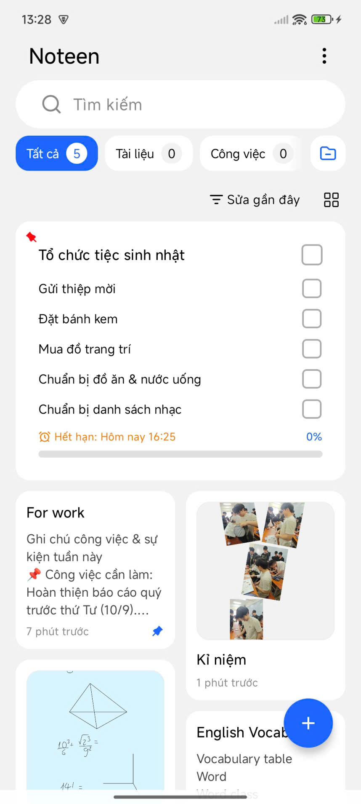
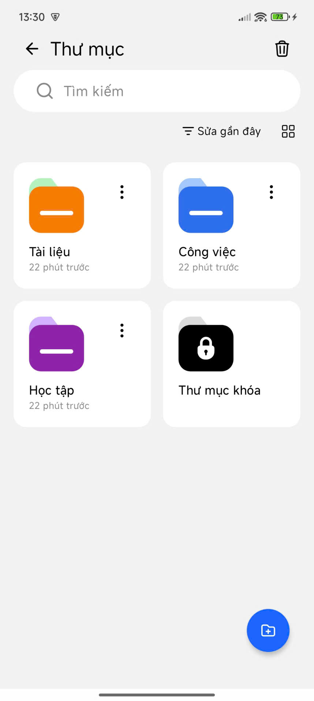
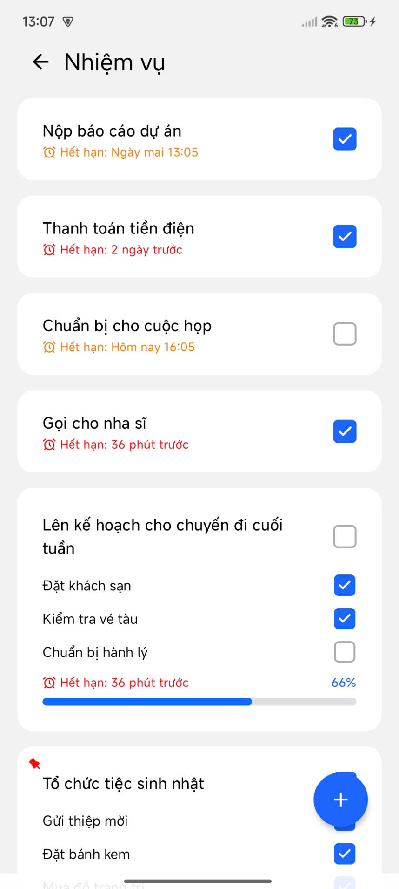
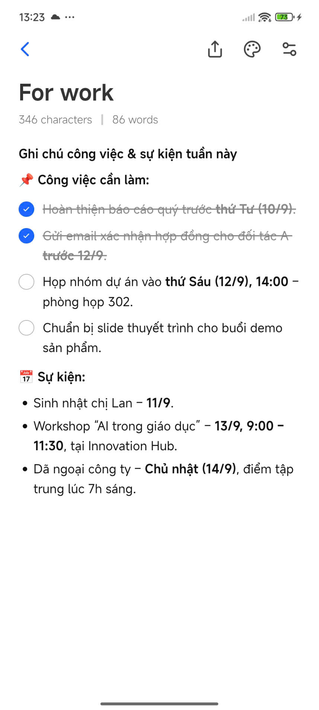
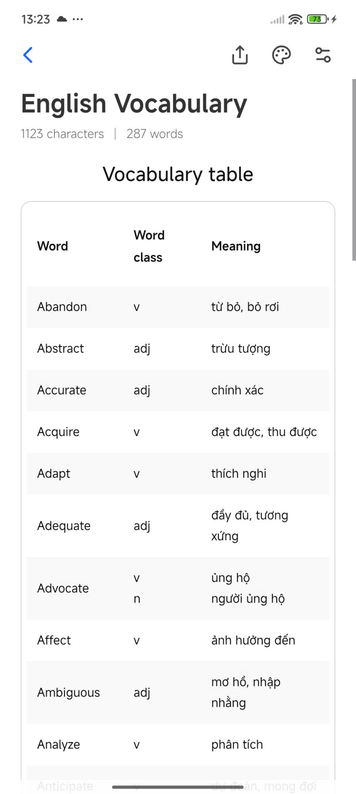
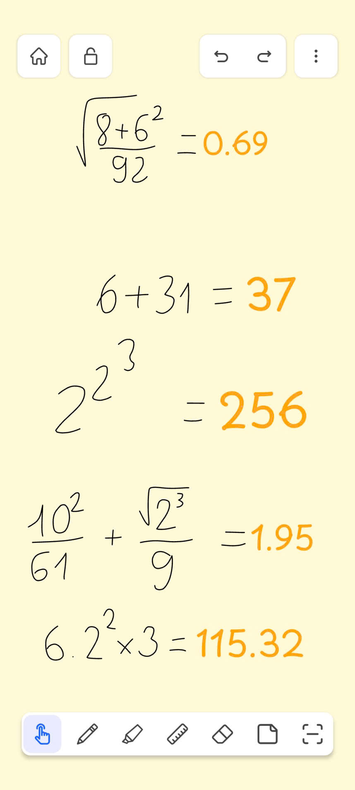
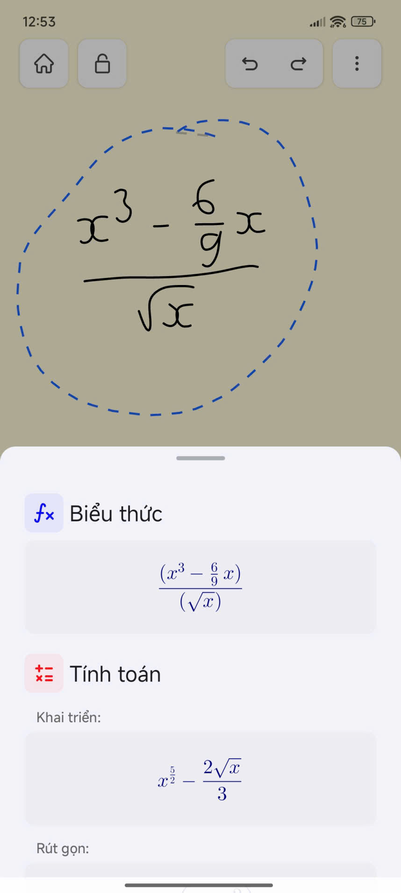
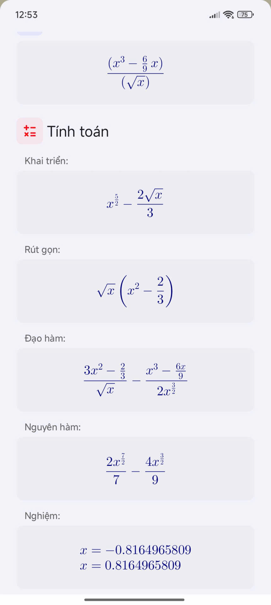

# 📝 Noteen – Smart Note-Taking & Task Management App

  
  
  

---

## 📌 Introduction
**Noteen** is a mobile application designed to combine **note-taking** and **task management** with an **AI-powered math-solving canvas**.  

⚠️ *This repository only contains a **preview version** with screenshots and demo videos. The source code is currently **not public**. We sincerely apologize for this inconvenience.* 🙏  

---

## ✨ Features
- 📒 **Notes & Tasks** – Organize notes, tasks, and folders with a clean interface.  
- 🖊️ **AI Math Solver** – Draw math expressions on canvas, instantly recognized and solved.  
- ☁️ **Cloud Sync** – Backup and synchronize with Firebase.  
- 🎨 **Modern UI** – Built using **Kotlin + Jetpack Compose**.  
- 🔐 **Authentication** – Secure user accounts and cross-device access.  

---

## 📱 Screenshots

  
  
  
  
  

All screenshots are available in [`docs/images/`](docs/images).

---

## 🎥 Demo Videos

All demo videos are stored in [`docs/videos/`](docs/videos).  

- ✍️ Canvas Drawing: [Demo Canvas](docs/videos/Demo%20Canvas.mp4)  
- ➗ Math Recognition: [Demo Canvas Calculation](docs/videos/Demo%20Canvas%20Calculation.mp4)  
- 📒 Note & Folder: [Demo Note & Folder Page 1](docs/videos/Demo%20Note%20%26%20Folder%20Page%201.mp4)  
- ✅ Task Management: [Demo Task Page](docs/videos/Demo%20Task%20Page.mp4)  

👉 You can also view all demo videos directly on Google Drive:  
🔗 [Noteen Demo Videos (Google Drive)](https://drive.google.com/drive/folders/1XX61G8h98LEzhguyoL3l01wOtX6dzksG?usp=drive_link)

---

## 🛠️ Tech Stack

**Frontend**  

**Backend**  

**AI / ML**  

**Tools**  

---

## 🚀 Status
- Current stage: **Preview version**  
- Source code: **Private (not released)**  
- Demo screenshots & videos: Available in this repo  

---

## 👥 Team
- **Author:** [truongkun2004](https://github.com/truongkun2004)  
- **Team Member:** [Qhuy204](https://github.com/Qhuy204)  

---

🙏 *Apologies: The source code of Noteen is not public at this time. This repository only shares **preview screenshots and demo videos** of the app’s functionalities.*  
